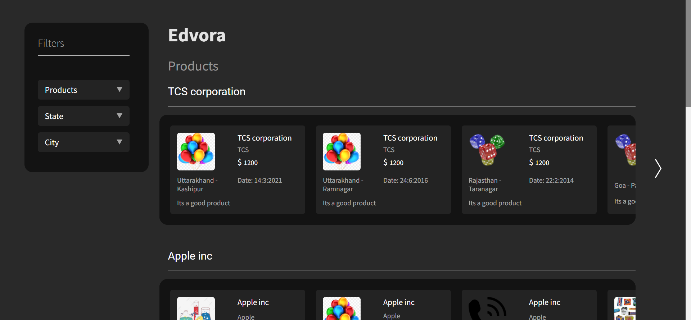
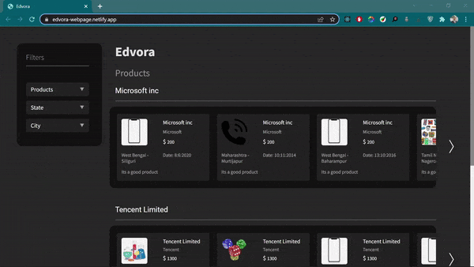

# Edvora Assessment

A simple web page built with React.js as a fulfillment to Edvora's Internship hiring process.

## How to run?

1. Make sure you downloaded Node.js

2. Clone the code

    ```bash
    git clone https://github.com/abdullahalshawafi/Edvora.git

    cd Edvora
    ```

3. Install the required packages

    `npm install`

4. Start the development server

    `npm start`

5. Open the browser at [http://localhost:3000](http://localhost:3000) to see the webpage

## Preview



<div style="text-align: center"></div>

## Files Structure

``` bash
src
├───assets
└───components
    ├───Card
    ├───Dropdown
    ├───Filters
    ├───Main
    │   └───services
    ├───Products
    └───Slider
```
